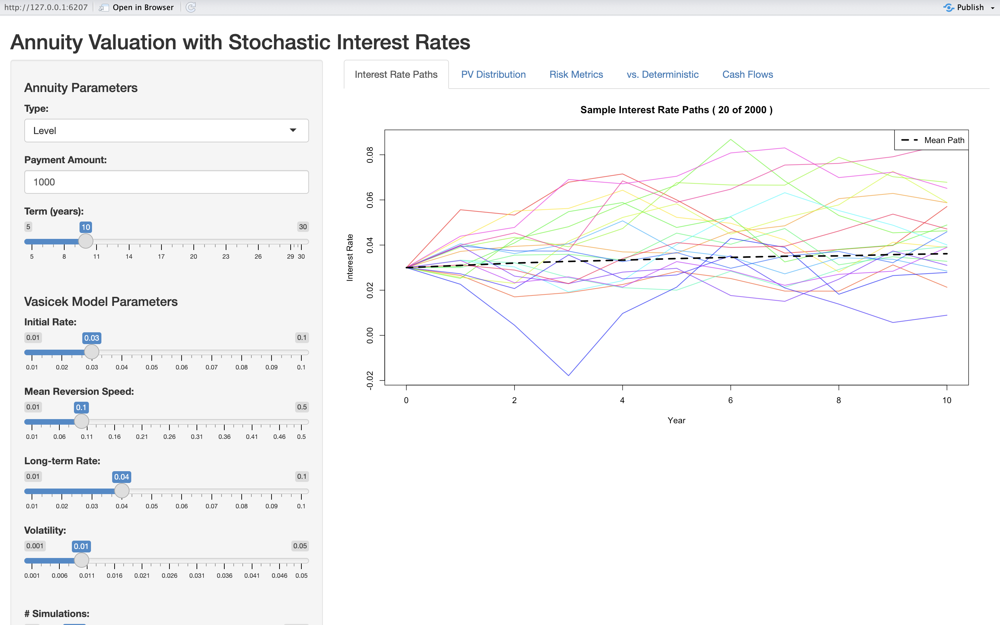
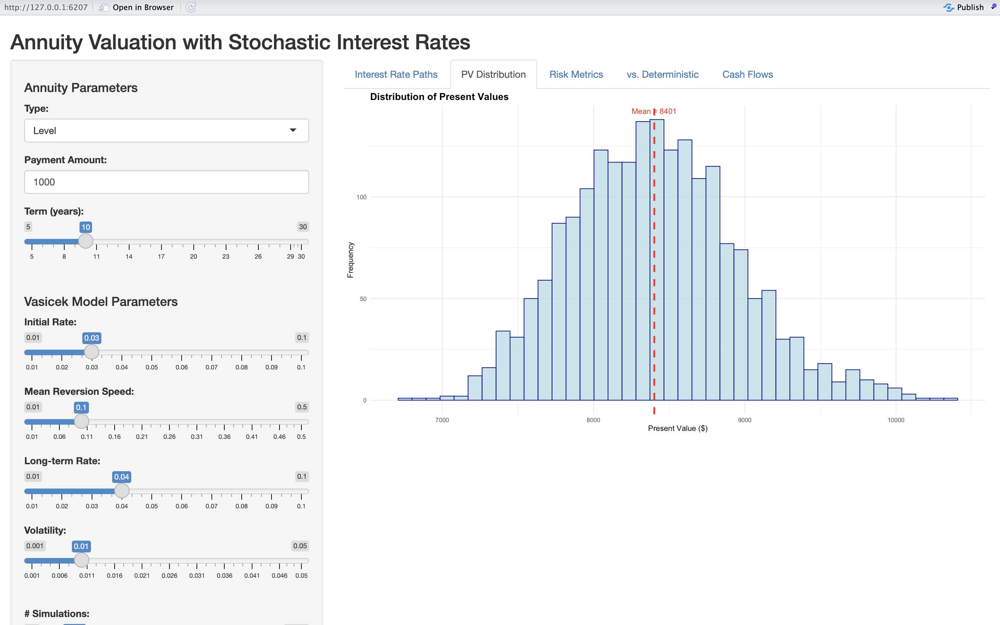
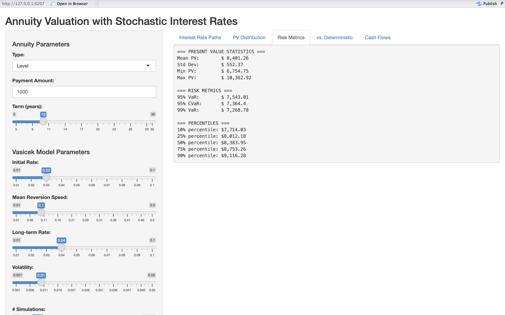
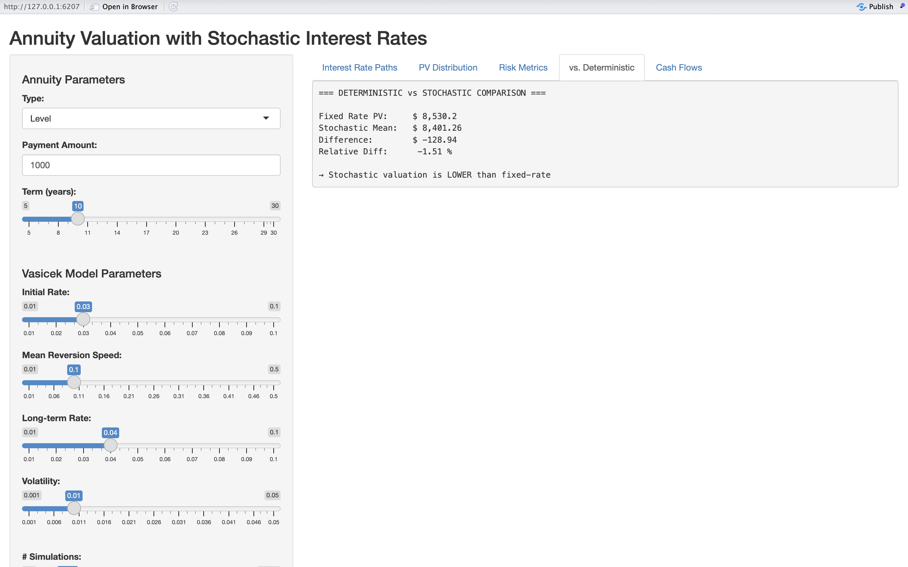
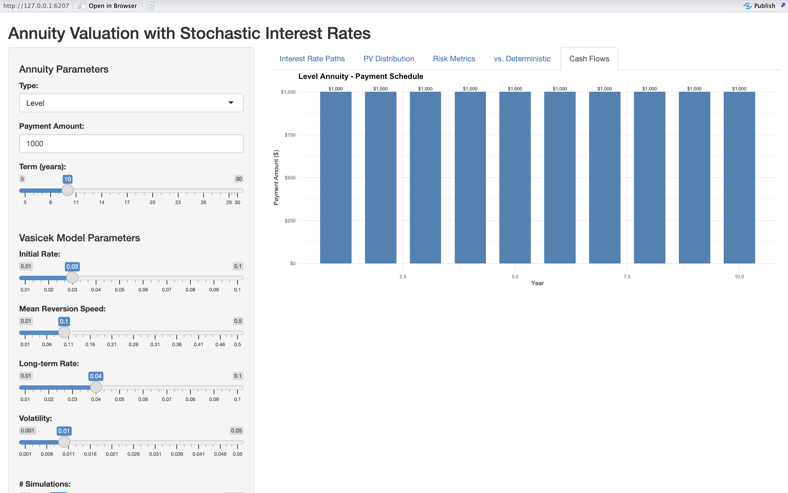

# Stochastic Interest Rate Annuity Valuation Model (R + Shiny) 📈

This interactive Shiny app simulates interest rate risk using the Vasicek model and Monte Carlo techniques to estimate the present value distribution of annuity liabilities under uncertainty — a key concept in asset-liability management (ALM).

## 📌 Features

- Choose from level, deferred, or growing annuities  
- Simulates thousands of stochastic interest rate paths using the Vasicek model  
- Calculates present values under each scenario to model valuation uncertainty  
- Visualizes interest rate paths, annuity cash flows, and PV distributions  
- Compares stochastic vs deterministic present value estimates  
- Computes risk metrics: mean, standard deviation, VaR, CVaR, percentiles  
- Built using R and Shiny for full interactivity  

## 🧮 Model Assumptions

- **Interest Rate Model**: Vasicek (mean-reverting with normal distribution)  
- **Cash Flows**: Annual frequency, deterministic annuity payouts  
- **Discounting**: Continuous compounding via cumulative short rates  

## 📊 App Tabs

- **Interest Rate Paths**: Plots 20 sample simulations + mean path  
- **PV Distribution**: Histogram of simulated present values  
- **Risk Metrics**: Displays mean, std dev, VaR, CVaR, and percentiles  
- **vs. Deterministic**: Compares average stochastic PV with the initial fixed rate  
- **Cash Flows**: Shows annuity schedule (bar chart)

## 🖼️ App Screenshots

**📈 Interest Rate Paths**

**📊 PV Distribution**

**📋 Risk Metrics**

**📉 Stochastic vs Deterministic PV**

**💵 Annuity Cash Flows**

## 🔧 Future Improvements

- Add CIR and Hull-White models for more realism in interest rate dynamics  
- Upload custom cash flows via CSV  
- Add asset-side modeling for full ALM simulation  
- Parameter sensitivity toggles (scenario analysis)  

## 🔗 Shiny App Link

- https://krattansi.shinyapps.io/annuity_stochastic_analysis/

## 💼 Why This Project?

As an actuarial science student, I built this project to explore interest rate risk, a fundamental concept in ALM. It combines statistical finance, R programming, and interactive visualization to simulate real-world challenges that actuaries face when valuing/pricing long-term liabilities.
